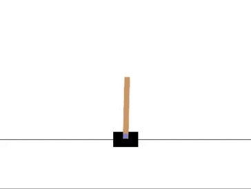
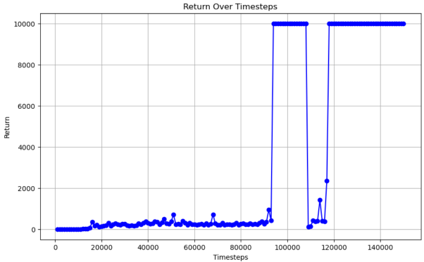

## Cartpole Balancer using Double Deep Q-Learning

  

---
This project uses double deep Q-learning to train an agent in Cartpole-V1 environment of Open AI's Gym. It takes inspiration from this [paper](https://arxiv.org/abs/1509.06461) by Google DeepMind.

The model consists of a target network that trains the main network by functioning as the TD target. These networks are synced at regular intervals to stabilize training. Furthermore, a replay buffer is used to store the agents experience and break correlation when training the main network.

Given:
- $Q_{1}$: Main network
- $Q_{2}$: Target network

$Y_{target} = r_{t+1} + \gamma \cdot \max_{a'} Q_2(s_{t+1}, a')$
$MSL = \mathbb{E}\left[\left(Y - Q_1(s, a)\right)^2\right]$

Integrating double Q-learning helps eliminate the problem of overestimation bias by incorporating randomness. 

$Y^{DDQN}_{\text{target}} = r_{t+1} + \gamma \cdot Q_2(s_{t+1}, \arg\max_{a'} Q_1(s_{t+1}, a'))$
 
- `Agent()` class:
1. `q_net`: the main network i.e online network. ($Q_1$)
2. `target_net`: the target network. ($Q_2$) 
3. `sync_net()`: function to sync weights of $Q_1$ and $Q_2$.
4. `target_vals()` & `q_vals`: functions for forward pass of target and main network. 

-  `ReplayBuffer()` class:
1. `buffer_size`, `n_env`, `device`: size of the replay buffer from which mini batch is sampled, number of parallel environments for sampling experience and the device available for training. 
2. `add()`: adds observation, next observation, action, reward and dones to the buffer. Also, implements FIFO functionality in case the buffer overflows.
3. `sample()`: randomly samples a mini-batch from replay buffer. 

- `ret_e()`: anneals the epsilon to adjust exploration-exploitation tradeoff.
- `calc_TD_target()`: calculates the TD target. ($Y_{target}$)
- `calc_TD_target_DDQN()`: calculates TD target according to double Q-learning rule. ($Y^{DDQN}_{target}$)
- `e_greedy_policy()`: samples actions according to e-greedy policy.
- `hyper`: an easyDict to store hyperparameters.
---

  

---